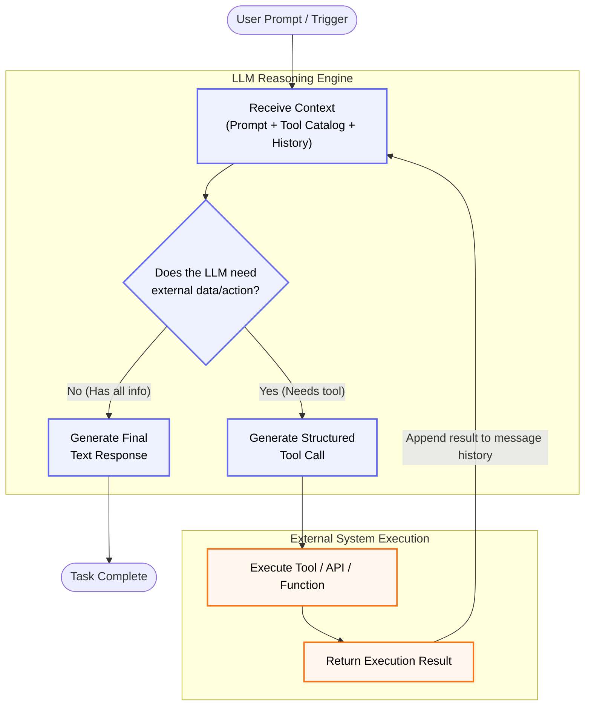

# Chapter 6: Tool Use and the Agent-Computer Interface

An LLM, no matter how capable, is stuck in time. It knows what was in its training data — not what the stock price is right now, not what's in your database today, not whether your latest deployment succeeded. Without tools, an agent is a sophisticated conversationalist trapped in a room with no phone, no computer, and no way to act on the world.

Tool use is the pattern that breaks the wall down. You give the LLM a catalog of available tools — functions it can call, APIs it can hit, commands it can execute — and the LLM generates structured requests to invoke them. The system executes those requests and feeds the results back. The LLM reasons about the results and decides what to do next.

This single capability transforms an LLM from a text generator into an actor. It is arguably the most important pattern in this book.

## The Tool-Use Loop

At its core, tool use follows a cycle:



The LLM sees a list of available tools — their names, descriptions, and parameter schemas — as part of its system context. When the LLM determines it needs external information or wants to take an action, it generates a structured tool call instead of (or alongside) a text response. Your code intercepts this call, executes the function, and returns the result as a new message. The LLM then continues reasoning with the result in context.

This cycle can repeat multiple times. A research agent might search the web, read a result, search again with a refined query, read another result, and then synthesize — making four tool calls before producing a final answer.

The key insight: **the LLM decides *when* and *which* tool to call, but your code decides *how* the tool is executed.** The LLM never directly accesses the internet, runs code, or writes files. It expresses an intent ("I want to search for X"), and your tool executor handles the actual execution in a controlled environment. This separation is what makes tool use both powerful and safe.

## Implementation in Python

Modern LLM APIs make tool use straightforward. You define tools as JSON schemas, pass them to the model, and handle the structured output.

```python
import json
from openai import OpenAI

client = OpenAI()

# Define tools as a list of schemas
tools = [
    {
        "type": "function",
        "function": {
            "name": "search_web",
            "description": "Search the web for current information on a topic. "
                          "Use when you need facts, data, or information that "
                          "may not be in your training data.",
            "parameters": {
                "type": "object",
                "properties": {
                    "query": {
                        "type": "string",
                        "description": "The search query. Be specific and descriptive.",
                    }
                },
                "required": ["query"],
            },
        },
    },
    {
        "type": "function",
        "function": {
            "name": "run_python",
            "description": "Execute Python code and return the output. "
                          "Use for calculations, data processing, or "
                          "generating visualizations.",
            "parameters": {
                "type": "object",
                "properties": {
                    "code": {
                        "type": "string",
                        "description": "Python code to execute. "
                                      "Print results you want to see.",
                    }
                },
                "required": ["code"],
            },
        },
    },
]
```

The descriptions matter more than you might expect. The LLM selects tools based primarily on these descriptions. A vague description — "search stuff" — leads to inconsistent tool selection. A precise description — "Search the web for current information on a topic. Use when you need facts, data, or information that may not be in your training data." — gives the model clear selection criteria.

Now the tool executor:

```python
def search_api(query: str) -> str:
    """Search the web. Replace with your preferred search provider."""
    # Placeholder: integrate with Bing, Google, Tavily, etc.
    raise NotImplementedError("Integrate with a search API (e.g., Tavily, Bing, Google).")


def run_sandboxed_python(code: str) -> str:
    """Execute Python in a sandbox. Replace with a real sandbox."""
    # Placeholder: use Docker, E2B, or a subprocess jail in production.
    raise NotImplementedError("Integrate with a sandboxed execution environment (e.g., E2B, Docker).")


def execute_tool(name: str, arguments: dict) -> str:
    """Execute a tool call and return the result as a string."""
    if name == "search_web":
        return search_api(arguments["query"])
    elif name == "run_python":
        return run_sandboxed_python(arguments["code"])
    else:
        return f"Error: Unknown tool '{name}'"


def agent_loop(user_message: str, max_iterations: int = 10) -> str:
    """Run the tool-use loop until the agent produces a final response."""
    messages = [{"role": "user", "content": user_message}]
    
    for _ in range(max_iterations):
        response = client.chat.completions.create(
            model="gpt-4o",
            messages=messages,
            tools=tools,
        )
        
        message = response.choices[0].message
        messages.append(message)
        
        # If no tool calls, we have the final response
        if not message.tool_calls:
            return message.content
        
        # Execute each tool call
        for tool_call in message.tool_calls:
            result = execute_tool(
                tool_call.function.name,
                json.loads(tool_call.function.arguments),
            )
            messages.append({
                "role": "tool",
                "tool_call_id": tool_call.id,
                "content": str(result),
            })
    
    return "Agent reached maximum iterations without a final response."
```

This is the minimal tool-use agent. Around 40 lines of code. It loops until the model generates a response without tool calls (its "I'm done" signal), or until it hits the iteration limit. Every production agent builds on this foundation.

## The Agent-Computer Interface

Here's where most tool implementations succeed or fail: the quality of the tool interface itself.

Anthropic coined the term **Agent-Computer Interface (ACI)** as a parallel to Human-Computer Interface (HCI). The argument: you should invest as much thought in how your agent interacts with tools as interface designers invest in how humans interact with software. The LLM is a user of your tools. It reads descriptions, interprets parameter names, and makes sense of error messages. If these are confusing, the LLM will make mistakes — just like a human would with a bad UI.

### Tool Naming and Descriptions

Poor tool name: `do_thing`
Good tool name: `search_company_knowledge_base`

Poor description: "Searches stuff"
Good description: "Search the internal knowledge base for company policies, procedures, and past decisions. Returns the top 5 most relevant documents. Use this when the user asks about company policy, internal procedures, or 'how we do things.'"

The description serves three purposes: it tells the model **what** the tool does, **when** to use it, and **what** it returns. Cover all three.

### Parameter Design

Apply the same principles you'd use for a good API:

**Use enums over free-text when the options are fixed.**

```python
# Bad: the model might generate "ascending", "asc", "ASC", "up"
{"type": "string", "description": "Sort order"}

# Good: constrained to valid values
{"type": "string", "enum": ["asc", "desc"], "description": "Sort order"}
```

**Make the default behavior sensible.** If most queries need the top 10 results, don't require the user to specify `limit: 10` every time. Make it a default.

```python
{
    "type": "object",
    "properties": {
        "query": {"type": "string", "description": "Search query"},
        "limit": {
            "type": "integer",
            "description": "Max results to return (default: 10)",
            "default": 10,
        },
    },
    "required": ["query"],  # limit is optional with a sensible default
}
```

**Minimize required parameters.** Every required parameter is a decision the LLM must make correctly. Fewer required parameters means fewer chances for error.

### Error Messages That Enable Recovery

When a tool fails, the error message goes back to the LLM as context. A useful error message tells the model *what went wrong* and *what to try instead.*

```python
# Bad: the model has no idea what to do next
return "Error: invalid input"

# Good: the model knows what to fix
return ("Error: 'start_date' must be in YYYY-MM-DD format. "
        "Received '03/15/2024'. Try '2024-03-15'.")
```

```python
# Bad: the model might keep retrying
return "Error: file not found"

# Good: the model can adjust its approach
return ("Error: file 'reports/q1.csv' not found. "
        "Available files in 'reports/': ['q1-2024.csv', 'q2-2024.csv']. "
        "Did you mean 'reports/q1-2024.csv'?")
```

This is the tool-design equivalent of poka-yoke — mistake-proofing. Anthropic's work on SWE-bench found that tool improvements (better error messages, absolute path requirements, syntax-aware editing) produced as much performance gain as improving the agent prompts themselves. The tools are part of the prompt.

### Poka-Yoke: Mistake-Proofing Your Tools

Some tool errors are preventable by design:

```python
import os


def read_file(filepath: str) -> str:
    """Read a file's contents."""
    # Poka-yoke: convert relative paths to absolute
    filepath = os.path.abspath(filepath)
    
    if not os.path.exists(filepath):
        # List nearby files to help the model self-correct
        directory = os.path.dirname(filepath)
        if os.path.isdir(directory):
            available = os.listdir(directory)[:10]
            return f"File not found: {filepath}. Files in {directory}: {available}"
        return f"File not found: {filepath}. Directory does not exist: {directory}"
    
    with open(filepath, "r") as f:
        return f.read()
```

The guiding principle: **anticipate the mistakes the LLM is likely to make, and design the tool to either prevent them or recover gracefully.** LLMs commonly confuse relative and absolute paths, use wrong date formats, pass string IDs where integers are expected, and forget required parameters. Handle these at the tool level.

## Tool Selection at Scale

With 5-10 tools, the LLM can see all tool schemas in its context and make reliable selections. With 50 or 200 tools, you hit two problems: the schemas consume too many tokens, and the model's selection accuracy degrades as the menu grows.

The solution is **tool retrieval** — RAG applied to tool descriptions rather than documents.

```python
from chromadb import Client

# Build a tool description index
tool_store = Client().create_collection("tools")

for tool in all_tools:
    tool_store.add(
        documents=[tool["function"]["description"]],
        metadatas=[{"name": tool["function"]["name"]}],
        ids=[tool["function"]["name"]],
    )


def select_relevant_tools(query: str, k: int = 5) -> list[dict]:
    """Retrieve the k most relevant tools for a given query."""
    results = tool_store.query(query_texts=[query], n_results=k)
    
    selected_names = [m["name"] for m in results["metadatas"][0]]
    return [t for t in all_tools if t["function"]["name"] in selected_names]
```

This is the Gorilla approach: embed tool descriptions in a vector store, and for each query, retrieve only the most relevant tools to include in the prompt. The LLM sees a focused menu of 5-10 tools instead of 200, which improves both accuracy and token efficiency.

A simpler alternative is **tool grouping**: organize tools into categories (search tools, file tools, database tools, communication tools) and let the LLM first select a category, then select a specific tool. This is routing (Chapter 5) applied to tool selection.

## Model Context Protocol (MCP)

MCP is an open standard that is changing how tools are distributed and discovered. Before MCP, every agent framework had its own way of defining, registering, and calling tools. Tools written for LangChain didn't work in AutoGen. Tools built for one company's internal system couldn't be shared.

MCP defines a standard protocol between **clients** (agent applications) and **servers** (tool providers). An MCP server exposes a set of tools with standardized schemas. An MCP client can discover what tools are available, read their descriptions, and call them — regardless of what framework the client or server was built with.

```
Agent Application (MCP Client)
    │
    ├─→ MCP Server: File System Tools
    │     ├── read_file
    │     ├── write_file
    │     └── list_directory
    │
    ├─→ MCP Server: Database Tools
    │     ├── query_sql
    │     └── list_tables
    │
    └─→ MCP Server: External API Tools
          ├── search_web
          └── get_weather
```

The practical impact for agent engineers:

1. **Tool reuse.** Build a tool server once, use it across any MCP-compatible agent.
2. **Tool discovery.** An agent can query an MCP server to learn what tools are available at runtime.
3. **Separation of concerns.** The team building the database tool server doesn't need to know anything about the agent framework that will call it.
4. **Security boundaries.** Each MCP server runs in its own process with its own permissions. The file system server can only access directories you've explicitly allowed. The database server connects with credentials you control.

MCP is still early — not all frameworks support it fully, and the ecosystem of public MCP servers is growing. But the direction is clear: tools are becoming a shared infrastructure layer rather than a framework-specific implementation detail.

## Case Study: Research Agent

Let's build a research agent that can search the web, read documents, execute Python for data analysis, and compile findings. This demonstrates the tool-use loop across multiple iterations with different tools.

```python
research_tools = [
    {
        "type": "function",
        "function": {
            "name": "search_web",
            "description": "Search the web for current information. Returns "
                          "titles, snippets, and URLs of top results.",
            "parameters": {
                "type": "object",
                "properties": {
                    "query": {
                        "type": "string",
                        "description": "Search query. Be specific — include "
                                      "dates, names, or technical terms.",
                    }
                },
                "required": ["query"],
            },
        },
    },
    {
        "type": "function",
        "function": {
            "name": "read_webpage",
            "description": "Read the full text content of a webpage. Use after "
                          "search_web to get details from a specific result.",
            "parameters": {
                "type": "object",
                "properties": {
                    "url": {
                        "type": "string",
                        "description": "Full URL of the page to read.",
                    }
                },
                "required": ["url"],
            },
        },
    },
    {
        "type": "function",
        "function": {
            "name": "run_python",
            "description": "Execute Python code for calculations, data analysis, "
                          "or generating charts. Print results you want to see.",
            "parameters": {
                "type": "object",
                "properties": {
                    "code": {
                        "type": "string",
                        "description": "Python code to execute.",
                    }
                },
                "required": ["code"],
            },
        },
    },
    {
        "type": "function",
        "function": {
            "name": "save_finding",
            "description": "Save a research finding with its source. Use this "
                          "to record important facts as you discover them.",
            "parameters": {
                "type": "object",
                "properties": {
                    "finding": {
                        "type": "string",
                        "description": "The fact or insight to record.",
                    },
                    "source": {
                        "type": "string",
                        "description": "URL or citation for the source.",
                    },
                },
                "required": ["finding", "source"],
            },
        },
    },
]
```

Notice how the tool descriptions guide the agent's workflow. `read_webpage` says "Use after search_web" — this teaches the model the expected sequence. `save_finding` says "Use this to record important facts as you discover them" — this encourages the agent to accumulate structured data as it works.

A session with this agent might look like:

```
User: "What was the global AI market size in 2024, and what's the growth 
       projection through 2030?"

Agent thinks: I need current market data. Let me search.
  → Tool call: search_web("global AI market size 2024")
  ← Results: [Fortune Business Insights: $244B..., Statista: ...]
  
Agent thinks: Let me read the full report for detailed numbers.
  → Tool call: read_webpage("https://fortunebusinessinsights.com/...")
  ← Returns: Full article text with market segments, CAGR, projections
  
Agent thinks: Good data. Let me save this finding.
  → Tool call: save_finding(
        finding="Global AI market valued at $243.7B in 2024",
        source="https://fortunebusinessinsights.com/..."
    )
  
Agent thinks: I should verify with a second source.
  → Tool call: read_webpage("https://statista.com/...")
  ← Returns: Statista's estimate and projections
  
Agent thinks: The numbers are close. Let me calculate the CAGR.
  → Tool call: run_python("""
        import math
        start = 243.7  # 2024
        end = 827.0    # 2030 projection
        years = 6
        cagr = (end/start)**(1/years) - 1
        print(f"CAGR: {cagr:.1%}")
    """)
  ← Output: "CAGR: 22.6%"

Agent thinks: I have enough data from two sources. Let me synthesize.
  → Final response: [Synthesized answer with citations]
```

Six tool calls, four different tools, two sources cross-referenced, one calculation verified. This is what tool use enables: the model didn't memorize the 2024 market size — it went and found it, verified it, and computed the derived statistics.

## Security Considerations

Tool use is where agent security becomes critical. An LLM with tool access can:

- **Execute arbitrary code** (if you give it a code execution tool without sandboxing)
- **Read sensitive files** (if file system tools aren't scoped)
- **Make unintended API calls** (if network tools aren't restricted)
- **Leak data** (by including sensitive tool results in responses)

Essential guardrails:

1. **Sandbox code execution.** Never let agent-generated code run in your production environment. Use containers, VMs, or restricted execution environments. Chapter 14 covers this in depth.

2. **Scope file access.** File system tools should only access explicitly allowed directories. Deny by default.

3. **Validate tool arguments.** Don't trust the LLM's output as safe input. Validate and sanitize arguments before executing any tool.

4. **Rate-limit tool calls.** Set maximum iterations per session and per tool. An agent stuck in an infinite tool-calling loop will burn through your API budget.

5. **Log everything.** Every tool call, every argument, every result. You need this for debugging, auditing, and detecting misuse.

```python
def execute_tool_safely(name: str, arguments: dict) -> str:
    """Tool execution with safety checks."""
    # Rate limiting
    call_count = increment_call_counter(name)
    if call_count > MAX_CALLS_PER_TOOL:
        return f"Error: Rate limit reached for tool '{name}'. Max {MAX_CALLS_PER_TOOL} calls."
    
    # Argument validation
    if name == "read_file":
        path = os.path.abspath(arguments.get("filepath", ""))
        if not path.startswith(ALLOWED_DIRECTORY):
            return f"Error: Access denied. Files outside {ALLOWED_DIRECTORY} are not accessible."
    
    # Logging
    log_tool_call(name, arguments)
    
    # Execute
    result = execute_tool(name, arguments)
    
    # Log result
    log_tool_result(name, result)
    
    return result
```

## Token Cost Profile

> **Cost structure:** 1 initial call + N round-trip iterations. Each iteration includes the full conversation context (growing) plus tool results appended as messages.
>
> **Typical range:** A 3-tool-call session with moderate context generates roughly 15,000–30,000 total tokens. Context grows with each round because the full message history is re-sent — the third iteration processes all prior tool calls and results as input.
>
> **Cost multiplier vs. single call:** 3–8× depending on iteration count and tool result sizes.
>
> **Where cost grows:** Large tool results (e.g., search returning full web pages), many iterations, and verbose system prompts that are re-sent every round. Truncate tool results aggressively — the model rarely needs the full output.
>
> **Cost-saving tip:** Set `max_iterations` conservatively (5–10). Monitor per-session tool call counts. If average iterations exceed 4, your tool descriptions or task decomposition likely need improvement.

## Tradeoffs and Failure Modes

**Tool selection errors.** With similar-sounding tools, the LLM may pick the wrong one. "search_documents" vs. "search_web" vs. "search_database" — the model needs clear descriptions to distinguish them. When in doubt, reduce the number of similar tools or merge them into one with a `source` parameter.

**Argument hallucination.** The LLM sometimes invents plausible-looking but incorrect tool arguments. A file path that doesn't exist. A search query with a quoted phrase the user never said. An API endpoint that was never defined. Validate arguments and provide actionable error messages.

**Infinite loops.** An agent can get stuck calling the same tool repeatedly without making progress. The search results aren't helpful, so it searches again with a slightly different query, gets the same results, searches again. The `max_iterations` guard in the agent loop is your primary defense. Consider also detecting repeated identical calls and breaking the loop early.

**Cost accumulation.** Each tool call typically requires at least one additional LLM call (to process the result). A five-tool-call session means roughly 6 LLM invocations. With expensive models and slow tools, costs add up quickly. Monitor per-session cost and set budgets.

**Latency variability.** Tool execution times are unpredictable. A web search might return in 200ms or 5 seconds. A code execution might timeout. Users waiting for agent responses experience this variability directly. Stream partial results where possible (Chapter 16).

### Observability Checklist

> **What to log:** Each tool call (name, arguments, result summary, latency), tool selection rationale (if available from chain-of-thought), iteration count per session, tool errors and retries, total session token count.
>
> **Key metrics:** Tool call frequency by tool name, tool error rate per tool, average iterations per task, per-session cost, tool latency distribution (P50/P95/P99), loop termination reason (natural completion vs. max iterations).
>
> **Alerts to set:** Average iterations per session increasing (tool descriptions may need revision), any tool error rate exceeding 5%, sessions hitting max_iterations (indicates stuck agents), per-session cost exceeding budget threshold.
>
> **Debugging tip:** Log the full tool call sequence as a trace. The pattern of tool calls reveals agent strategy — repeated identical calls indicate a stuck loop, while a long sequence of different tools suggests scope creep. Both are actionable.

## When NOT to Use Tool Use

- **Pure generation tasks.** Writing a poem, drafting an email, summarizing a text — these don't need tools. The LLM has everything it needs in context.

- **When training knowledge is sufficient.** Questions about well-established facts, programming concepts, or historical events rarely need web search. Adding tools to these tasks adds latency without improving quality.

- **High-throughput batch processing.** If you're running 100,000 LLM calls in a batch, adding tool calls to each one multiplies your latency and API costs. Process in bulk using deterministic pipelines, and use LLMs only for the cognitive steps.

Tool use is the pattern that makes agents useful in the real world. Without it, you have text generation. With it, you have systems that can research, compute, verify, and act. But the tool catalog you design — the names, descriptions, parameters, error handling — is as important as the agent that uses it. Design your tools with the same care you'd design an API. Your LLM is the first consumer of that API, and it reads the documentation literally.

## Review Questions

**Knowledge & Design Questions:**

1. The chapter states: "the LLM decides *when* and *which* tool to call, but your code decides *how* the tool is executed." Explain why this separation is crucial for safety. Design a scenario where violating this principle could cause harm, and describe how your tool execution layer would prevent it.

2. You define a tool called "query_database" with a single parameter: `sql_query: str`. Why is this a dangerous tool design? Rewrite the schema to be safer — what constraints or structure would you add? How do these constraints change what the LLM can accomplish with the tool?

3. Tool use creates a loop: LLM generates call → system executes → result returned → LLM continues. This loop can repeat multiple times. Design a stopping condition: how do you prevent infinite loops where the LLM keeps calling tools without making progress? What metrics would you track to detect a stuck agent?

4. Compare tool use to prompt chaining (Ch4): chaining passes LLM output as input to the next step, while tool use calls external functions. When would you choose tool use over chaining? When is chaining sufficient? What does each pattern optimize for?

**Implementation Questions:**

5. Write working Python code that implements the tool-use loop: (1) define 3 tools (e.g., search_web, get_weather, calculate), (2) create an agentic loop that repeatedly calls the LLM, (3) on each iteration, check if the LLM generated a tool call or a text response, (4) execute the tool if called, and return the result to the LLM, (5) stop when the LLM returns text (not a tool call). Include error handling for invalid tool calls.

6. Design and implement a tool with input validation and safe execution: create a "write_file" tool that an agent can call, but only to write to a specific directory, with a maximum file size, and with content filtering. Write the Python code that: (1) validates the agent's intent, (2) enforces the constraints, (3) returns a clear error message if constraints are violated, so the agent can understand why the tool call failed.

## Sources

- Anthropic. "Building Effective Agents." *Anthropic Engineering Blog*, December 2024. https://www.anthropic.com/engineering/building-effective-agents. Accessed April 2025.
- Andrew Ng. "Agentic Design Patterns Part 3: Tool Use." *DeepLearning.AI*, April 2024. https://www.deeplearning.ai/the-batch/agentic-design-patterns-part-3-tool-use/. Accessed April 2025.
- Patil, S., et al. "Gorilla: Large Language Model Connected with Massive APIs." *arXiv:2305.15334*, 2023.
- Anthropic. "Model Context Protocol Specification." https://modelcontextprotocol.io/. Accessed April 2025.
- OpenAI. "Function Calling Documentation." https://platform.openai.com/docs/guides/function-calling. Accessed April 2025.
